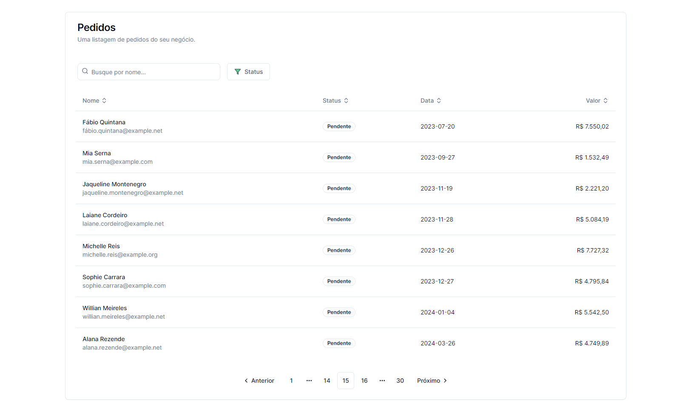

# Search, Filter, Sorting, and Pagination with Next.js

In this Mini Project, I implemented an API that returns a listing of orders. As simple as it might seem, this is a powerful API: it allows us to pass, as query parameters, textual search, filters, sorting, and pagination. Best of all: **all this information stays in the URL** for easy sharing!

All this on the front-end using Next.js and Server Components!

## ScreenShot



## Technologies
  - Next14
  - Tailwind
  - shadcn/ui
  - Typescript


## The API

The API used was developed by the Codante team. Check they website

The API documentation is available at <a target="_blank" href="https://apis-docs.codante.io/orders-api">https://apis-docs.codante.io/orders-api</a>.

## Run Locally
Clone the project

```bash
  git clone https://github.com/renatorrocha/filtro-ordenacao-e-paginacao-next
```

Go to the project directory

```bash
  cd filtro-ordenacao-e-paginacao-next
```

Install dependencies

```bash
  pnpm install
```

Run the project

```bash
  pnpm run dev
```

## Features

- [X] Connect API data
  - Populate the table with the data
  - Utilize fields such as:
    - Customer Name
    - Customer Email
    - Status
    - Order Date
    - Order Value

- [X] Textual Search
  - by Customer Name
  - Must be server-side (via API)
  - Must be reflected in the URL

- [X] Status Filter
  - Through the filter button (pending, completed)
  - Server-side
  - Must be reflected in the URL

- [X] Field Sorting
  - Sorting for Order Date and Order Value
  - Should be triggered with a click on the column name
  - Change the icon to match the sorting
  - Must be reflected in the URL

- [X] Pagination
  - Enable and disable buttons when there are no more pages
  - Must be reflected in the URL

### Challenge
  - [X] Use the UseDebounce hook to delay the execution of textual search
